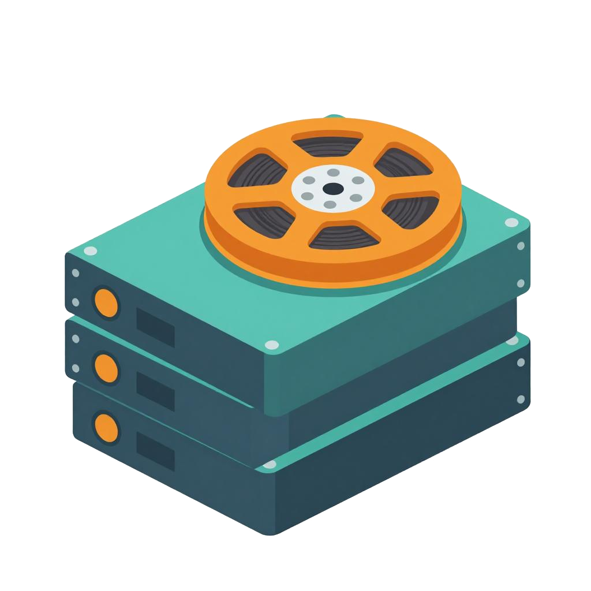

# Tomovee

[](https://codecov.io/gh/cybersouris/tomovee)
[](https://github.com/cybersouris/tomovee/actions/workflows/lint.yaml)
[](https://github.com/cybersouris/tomovee/actions/workflows/lint.yaml)
[](https://github.com/cybersouris/tomovee/actions/workflows/release.yaml)
[](https://go.dev/)
[](https://github.com/cybersouris/tomovee/releases)

<table>
  <tr>
    <td width="200" valign="top"></td>
    <td valign="top">
Tomovee is a self-hosted catalogue for your movie and TV library. It scans
media folders, extracts technical metadata with `ffprobe`, matches titles
against online and offline sources, groups multiple versions of the same title,
and serves a browsable web UI plus a JSON API.
    </td>
  </tr>
</table>

## Features

- **Discovery & metadata** — recursive scan of configured folders with `ffprobe`
  extraction (resolution, video/audio codecs, HDR, frame rate, tracks).
- **Layered matching** — OpenSubtitles file-hash lookup, then a TMDB search,
  then an offline IMDb dataset (titles plus alternative titles, episodes, and
  ratings), leaving ambiguous files for manual review.
- **Version grouping** — several files of the same movie or episode (e.g. 1080p
  and 4K) share one catalogue entry.
- **Incremental re-scans** — unchanged, already matched files are skipped;
  disappeared files are flagged `missing`.
- **Manual re-matching** — resolve unmatched entries by TMDB or IMDb id.
- **Web UI + REST API** — browse, search, filter, inspect versions and tracks,
  trigger per-library scans and background matching with live progress, and
  manage per-library watching.
- **Folder watching** — optional polling of enabled libraries picks up new files
  automatically.
- **Local poster cache** — posters are downloaded and served from disk.
- **Frame fallback** — items without online artwork get a still frame extracted
  from the video (taken 10 minutes in, stepping 5 minutes past uniform frames).

## Requirements

- Go 1.26 or newer.
- `ffprobe` (from FFmpeg) on `PATH`.
- `ffmpeg` on `PATH` for fallback frame posters (optional; scans skip it if
  absent).
- Optional: a TMDB API key and OpenSubtitles credentials for online matching.

## Build

```sh
make build        # builds bin/tomovee using the committed web UI assets
make test         # go test ./...
make vet          # go vet ./...
```

To rebuild the web UI from source (requires Node.js and npm):

```sh
make frontend     # cd internal/webui && npm ci && npm run build
```

The built assets live in `internal/webui/dist` and are embedded into the binary
with `go:embed`.

## Configuration

Tomovee reads a YAML file, by default
`$XDG_CONFIG_HOME/tomovee/config.yaml` (or `~/.config/tomovee/config.yaml`).
Pass `--config PATH` to override. See `config.example.yaml` for every option.

Minimal example:

```yaml
libraries:
  Movies: ~/Media/Movies
  TV: ~/Media/TV
api:
  tmdb_key: "your-tmdb-api-key"
```

## Usage

```sh
tomovee scan --config config.yaml     # one-shot scan, then exit
tomovee serve --config config.yaml    # daemon: REST API + web UI
tomovee version
```

`serve` listens on `listen` (default `127.0.0.1:8080`) and serves the web UI at
`/` and the JSON API under `/api/v1/`.

## Security

- Tomovee has **no authentication**: the API is meant to be reached only from
  your own machine. `localhost` in `listen` is bound strictly to loopback. Bind
  it to a network interface (`0.0.0.0`, `192.168.1.10`) only on a trusted
  network.
- Media files are fed to `ffprobe`/`ffmpeg` (metadata probing, frame posters,
  remux/transcode) and therefore count as untrusted input. Run the daemon as an
  unprivileged user; consider a systemd sandbox or container if library folders
  are writable by others. Individual probe/extract runs are time-boxed.

## REST API

| Method | Path | Description |
| --- | --- | --- |
| `GET` | `/api/v1/catalog` | List/search entries (`q`, `media_type`, `genre`, `year`, `resolution`, `language`, `status`, `sort`, `order`, `limit`, `offset`) |
| `GET` | `/api/v1/catalog/{id}` | Entry detail with series data, episodes, versions and tracks |
| `POST` | `/api/v1/catalog/{id}/match` | Manual re-match (`{"tmdb_id": 603}` or `{"imdb_id": "tt0133093"}`) |
| `GET` | `/api/v1/unmatched` | Entries awaiting manual review |
| `POST` | `/api/v1/scan` | Start a background scan |
| `GET` | `/api/v1/scan/status` | Current scan job |
| `GET` | `/api/v1/scan/stream` | Server-sent events with live scan progress |
| `POST` | `/api/v1/match` | Start a background matching job |
| `GET` | `/api/v1/match/status` | Current matching job |
| `GET` | `/api/v1/match/stream` | Server-sent events with live match progress |
| `GET` | `/api/v1/settings` | Read settings and watch folders |
| `PUT` | `/api/v1/settings` | Toggle watching and per-folder state |
| `GET` | `/api/v1/posters/{id}` | Cached poster (redirects to TMDB on miss) |
| `POST` | `/api/v1/posters/prune` | Delete cached posters no longer referenced |

## Project layout

```
cmd/tomovee         CLI entry point (serve, scan)
internal/config     YAML config load/normalize/validate
internal/database   SQLite store, migrations, queries
internal/scanner    file discovery and classification
internal/metadata   ffprobe wrapper
internal/opensubtitles  hash computation and lookup
internal/tmdb       TMDB client
internal/imdb_datasets  offline IMDb dataset index (titles, akas, episodes, ratings)
internal/matcher    hash -> TMDB -> offline -> manual matching
internal/matching   background matching job over needs-lookup entries
internal/metacache  database-backed cache for TMDB lookups
internal/scan       scan orchestration and persistence
internal/watcher    watch-folder polling
internal/poster_cache   local poster downloads
internal/thumbnail  fallback frame extraction from video files
internal/webserver  REST API and SSE
internal/webui      Svelte SPA (source + embedded build)
```

## Development notes

- Exported identifiers use `Snake_Case`; unexported identifiers use
  `snake_case` (see `SPEC.md`).
- Format with `gofmt` (`make fmt`) and keep `go vet ./...` clean.
- Commits follow Conventional Commits.
